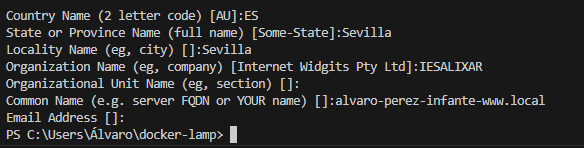

#1.Modifica el nombre de los virtualhost dados de ejemplo para que sean:
www.local -> nombre-apellidos-www.local
intranet.local -> nombre-apellidos-intranet.local

Accedemos al Archivo de Hosts
Abrir el archivo de hosts en el sistema. Este archivo generalmente se encuentra en:

Windows: C:\Windows\System32\drivers\etc\hosts

Editar el Archivo de Hosts y añadimos al final del texto lo siguiente
127.0.0.1    alvaro-perez-infante-www.local
127.0.0.1    alvaro-perez-infante-intranet.local
127.0.0.1    alvaro-perez-infante-phpmyadmin.local

Ahora nos vamos a nuestro proyecto que clonamos del profesor:

Y editamos el archivo de configuración:

Primero lo buildeamos y lo subimos:

Probamos que todo funcione correctamente:
http://alvaro-perez-infante-www.local/

http://alvaro-perez-infante-intranet.local:8060/

###1. Creación de Virtual Host para PhpMyAdmin

Se debe crear un nuevo archivo de configuración del virtual host que se llame nombre-apellidos-phpmyadmin.conf

Miramos que la página nos mande a donde corresponde:

###3. Modificación del Index.html de Intranet
   

###4. Añadir Nuevo Usuario

Realizamos un restart para que se actualize la información:

###5. Instalación de CMS Wordpress

Instalamos wordpress y lo metemos en la carpeta www del proyecto una vez realizado esto,entramos en el archivo wp-config-php y realizamos los siguientes cambios

Entramos en la ruta para ver que todo funciona
http://alvaro-perez-infante-intranet.local/wordpress/wp-admin/install.php

#PARTE 2: Instalación de Certificados SSL
###1. Generación de Certificados

###2. Configurar para el protocolo HTTPS

###3. Habilitar Módulo mod_ssl

